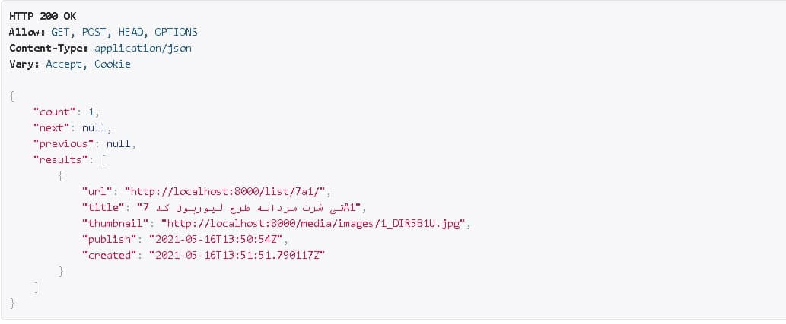
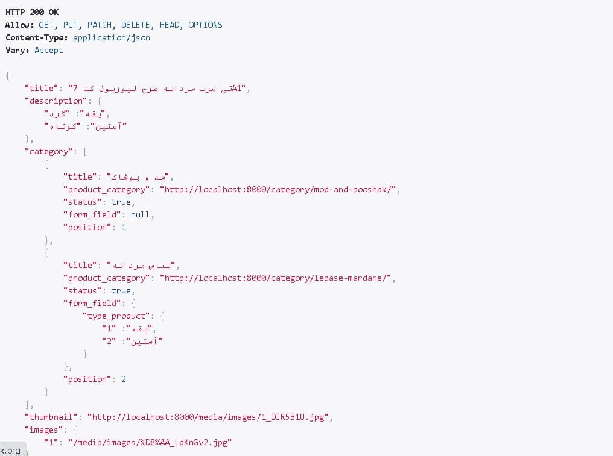
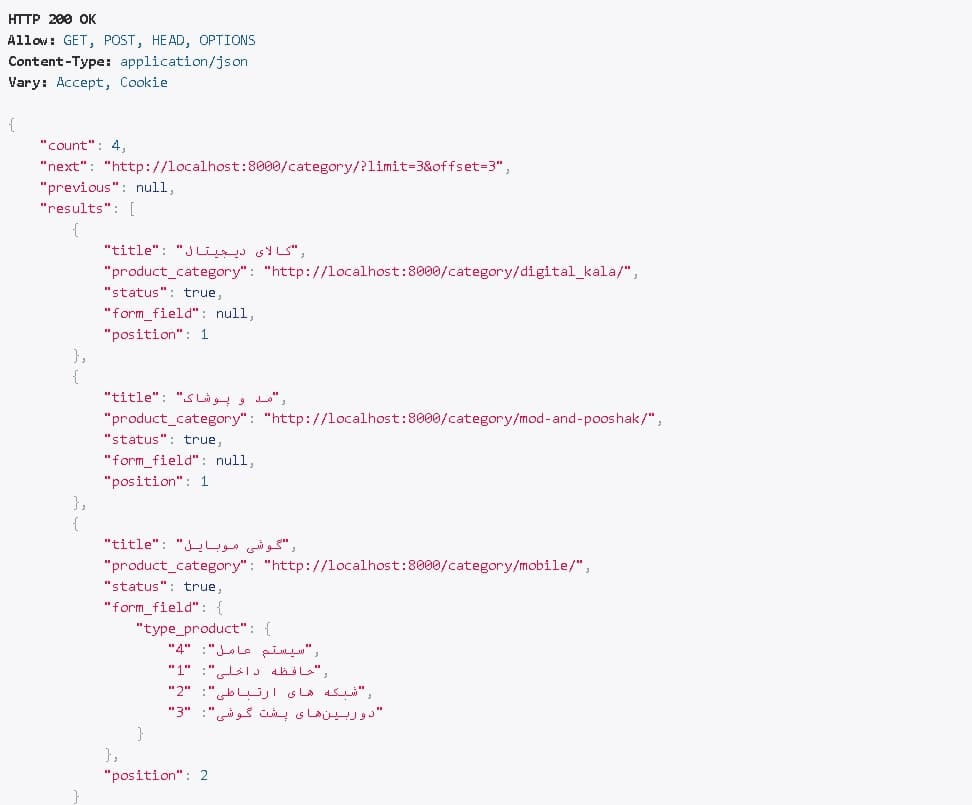
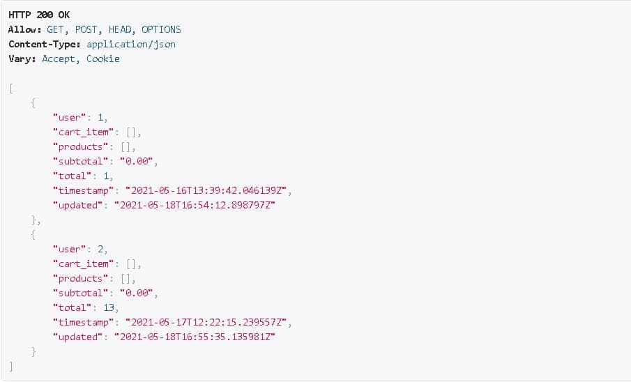

# How to RUN
```
python manage.py makemigrations --settings=config.settings.development
python manage.py migrate --settings=config.settings.development
pip install -r requirements.txt
python manage.py runserver --settings=config.settings.development
```
# Screen Shots

**http://localhost:8000/list/**

**http://localhost:8000/list/7a1/**

**http://localhost:8000/category/**

**http://localhost:8000/cart/user/**
